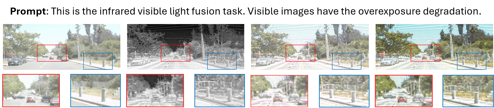

# [Bachelor's Thesis] Towards Robust Dense Prediction using Multimodal Fusion

**Author**: Kaan Durmaz


## 1. Create Environment
- Create Conda Environment
```
conda env create -f environment.yaml
conda activate sensor_fusion
```
- Install Dependencies
```
conda install pytorch==2.0.0 torchvision==0.15.0 pytorch-cuda=11.8 -c pytorch -c nvidia
```
If you have the device with the lower version of CUDA, you can try to install a lower version of torch, but torch > 1.10 is recommended. Please refer to the official website of PyTorch.

## 2. Choose Your Dataset

The datasets are available under dataset/

## 3. Pretrained Weights
The pretrained weights are under pretrained_weights/ folder.

## 4. Testing
```shell
# Overexposure
python3 ./SensorFusion/test_from_dataset.py  --weights_path "SensorFusion/pretrained_weights/ems/ours.pth" --dataset_path "SensorFusion/dataset/EMS_dataset/vis_Exposure/eval" --input_text "In the context of infrared-visible image fusion, visible images are affected by exposure issues." --save_path "/path/to/results"
```

### Gallery

Comparison of our approach with the baseline Text-IF model. From left to right the images are visible, infrared, fused using Text-IF and fused using our approach.



## 5. Train
```shell
python3 SensorFusion/train_fusion.py
```

## 6. References

The code of this model is based on the work of Yi et al.: 
```
@inproceedings{yi2024text,
  title={Text-IF: Leveraging Semantic Text Guidance for Degradation-Aware and Interactive Image Fusion},
  author={Yi, Xunpeng and Xu, Han and Zhang, Hao and Tang, Linfeng and Ma, Jiayi},
  booktitle={Proceedings of the IEEE/CVF Conference on Computer Vision and Pattern Recognition (CVPR)},
  year={2024}
}
```